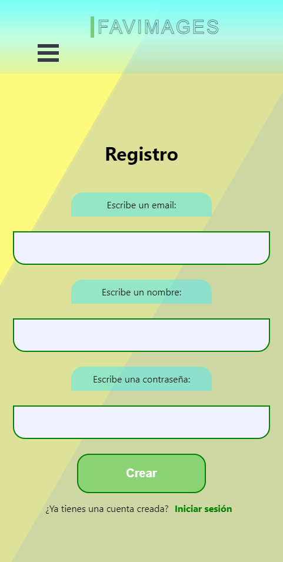

# ImagesTest
Proyecto fullstack realizado con las tecnologías de React y Styled Components para el frontend y Node y Express para el desarrollo del servidor y API, además
del uso de SQL (PostgreSQL) para la base de datos.

## Instalación

**Clonación proyecto**

`git clone https://github.com/pablomoga9/ImagesTest.git`

**Instalación de dependencias**

-Backend  
  
Encontrándonos en el fichero del proyecto clonado ejecutaremos el siguiente comando en terminal  
   
`npm install`  
  
-Frontend  
  
`cd client`  
  
`npm install`  

**Inicialización del proyecto**

Accediendo al fichero donde se encuentra el proyecto, ejecutaremos:

`npm start`
para iniciar el servidor  
  
Ejecutaremos de forma simultánea el fichero 'client':  
`cd client`  
`npm start`  
  
**.env**  
  
  
En los ficheros '.env.example' del fichero principal del proyecto y del fichero 'client' se encuentra  
la plantilla con la que deberemos rellenar los ficheros '.env' que creemos. Deberemos crear uno en el fichero  
principal y otro en 'client'.  
El proyecto ha sido llevado a cabo con la versión cloud de PostgreSQL, así que para poder realizar las órdenes  
pertinentes a la base de datos y contar con los datos de prueba ya generados deberemos usar la url íntegra que  
se aporta en el '.env.example' de 'client'.  
  
  
  
Con esto deberíamos ser capaces de iniciar el proyecto.

## Funcionamiento  
  
La aplicación nos permite crear cuentas con un correo, contraseña y nombre que aportemos inicialmente. A través de  
un proceso de autenticación podremos iniciar sesión y acceder a la opción de lectura,creación y actualización de  
imágenes que introduciremos a partir de una url.  
Se puede acceder también a las imágenes creadas por otros usuarios a través de la vista principal '/'. Para manipular  
 y ver nuestras propias imágenes debemos dirigirnos a nuestro perfil, donde también podremos modificar los datos de  
usuario (imagen de perfil, nombre, descripción).  
  
    
La aplicación ha sido desarrollada con Styled Components para la maquetación y estilos de la interfaz. Se ha realizado  
siguiendo el diseño 'mobile first', es decir, se debe ver con una resolución aproximada de 485px x 970px.  

  
### Login y Registro  
  
  Estos dos procedimientos han sido llevados a cabo con las tecnologías 'bcrypt' para el encriptado y posterior almacenado
  en la base de datos de la contraseña, y 'jsonwebtoken' para la generación de un token identificativo del usuario que inicia  
  sesión que quedará almacenado en las cookies.
  
    
  
   
  
  Ambas vistas están restringidas para aquellos usuarios que ya hayan iniciado sesión. Para poder volver a acceder, tendrán que 
  'Cerrar sesión' por medio del botón que se encuentra en el menú desplegable.  
  De la misma manera, aquellos usuarios que no hayan iniciado sesión, si tratan de acceder a cualquier perfil, serán devueltos mediante
  'useNavigate' a la vista de 'Login'.
  
  ### Home
  
  En esta vista encontramos la lista desplegada de todas las imágenes generadas por usuarios previamente. Acompañándolas, se encuentran los 
  datos de el usuario que las creó, el 'Título', la 'Fecha de publicación' y la 'Descripción'.  
  
  
  
   
  
  Estas dos imágenes son de la vista 'Home' para usuarios que no han iniciado sesión y para aquellos que sí, respectivamente.
  
  ### Perfil Usuario
  
  En esta vista tenemos la posibilidad de modificar nuestros datos de usuario por medio de un formulario que se desplegará al clickar 
  sobre el botón 'Actualizar'(el cierre es exactamente igual) donde podremos rellenar todos los campos o no.
  
   
    
    
   Algo más abajo, se encuentra el formulario de creación de imagen, deberemos aportar la URL, el título y una descripción.
    
   
      
   A continuación encontramos el despliegue de las imágenes creadas por el usuario que tiene su sesión iniciada en el navegador.
   Existe la opción de navegar por las distintas imágenes a través de la paginación, que distribuye la lista en grupos de 5 publicaciones 
   por página. 
    
  
      
      
   En la parte posterior de cada una de las publicaciones, encontramos dos botones, uno para 'Borrar' la publicación tanto de 
   los registros de la base de datos como del context de React y otro para, de nuevo, desplegar un formulario de edición de 
   la publicación.
      
    
